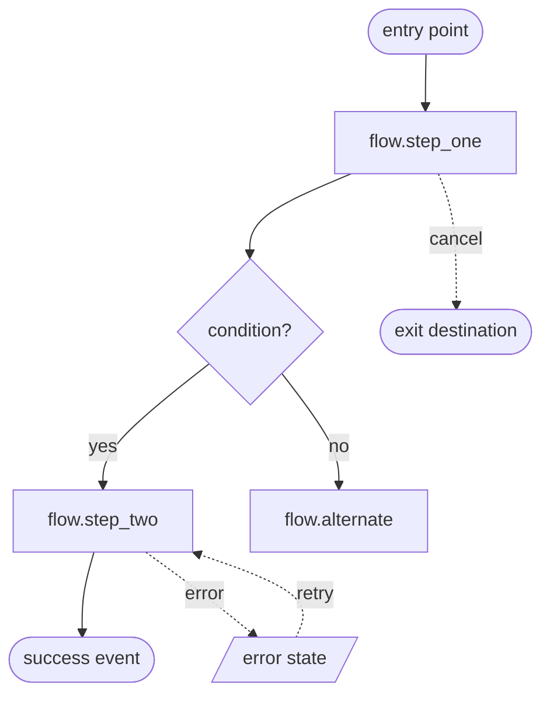

# [Flow name] — Flow Spec

**Owner:** · **Version:** · **Date:** · **Platforms:** iOS / Android
**Status:** draft / in review / approved for build

---

## 1. Goal

**User's job:** [what the user is actually trying to accomplish — not the task]
**Business outcome:** [what the company gets when this works]
**Success event:** `[single_event_name]`
**Target:** [current → target, with the window, e.g. "step 2→3 conversion 41% → 60% at Day 0"]

**Assumptions made:** [list them explicitly; this is where reviewers correct you cheaply]

---

## 2. Users and entry points

| Segment | State on arrival | Entry points | Expected share |
|---|---|---|---|
| New, cold launch | logged out, no data | store install | |
| Returning | authenticated, has data | app icon, push | |
| Deep link | unknown | push, universal link, share, widget | |

For each entry point: what state must be hydrated before the first screen renders, and what happens if it can't be.

---

## 3. Flow diagram

---

## 4. Steps

Repeat this block per step.

### Step N — `flow.step_name`

| Field | Value |
|---|---|
| **Precondition** | |
| **Purpose** | why this step exists; what it would cost to delete it |
| **Primary action** | |
| **Secondary actions** | |
| **Data read** | |
| **Data written** | what persists, where, and *when* |
| **Latency expectation** | and what shows during it |
| **Forward exit** | |
| **Back / cancel behaviour** | discard / draft / confirm |
| **Escape hatch** | |

**Copy**

| Element | String | Max chars |
|---|---|---|
| Title | | |
| Body | | |
| Primary CTA | | |
| Secondary CTA | | |
| Helper / legal | | |

**Analytics**

| Event | Properties | Fires when |
|---|---|---|
| | | |

---

## 5. Edge-state matrix

| # | Condition | Behaviour | Copy | Built? |
|---|---|---|---|---|
| 1 | Loading | | | |
| 2 | Empty | | | |
| 3 | No results | | | |
| 4 | Partial data | | | |
| 5 | Offline | | | |
| 6 | Slow (>2s) | | | |
| 7 | Validation error | | | |
| 8 | Server error | | | |
| 9 | Permission denied | | | |
| 10 | Auth expired | | | |
| 11 | Interruption / background | | | |
| 12 | Back / cancel | | | |
| 13 | Deep link mid-flow | | | |
| 14 | Duplicate / re-entry | | | |
| 15 | Locale (expansion, RTL) | | | |
| 16 | Accessibility (VO/TB, Dynamic Type, reduced motion) | | | |
| 17 | Low-end device | | | |

---

## 6. Platform differences

| Aspect | iOS | Android | Rationale |
|---|---|---|---|
| Navigation chrome | | | |
| Back behaviour | | | |
| Modal presentation | | | |
| Permission copy | | | |
| Purchase / store rules | | | |

---

## 7. Instrumentation summary

**Funnel:** `[step 1] → [step 2] → [step 3] → [success event]`, windowed at [Day 0 / Day 7 / …]
**Segments to watch:** platform, OS version, device tier, locale, acquisition source, permission state
**Guardrails:** crash-free sessions, cold start, support tickets, refund rate
**Consent gating:** [how SDK init is sequenced against the consent decision]

---

## 8. Accessibility and compliance checklist

- [ ] Focus order verified with VoiceOver and TalkBack end to end
- [ ] Completes at largest Dynamic Type / font scale without truncation
- [ ] Usable with Reduce Motion and Reduce Transparency enabled
- [ ] Contrast verified against real content, light and dark
- [ ] All targets ≥44pt (iOS) / 48dp (Android)
- [ ] No information conveyed by colour alone
- [ ] No redundant entry of data supplied earlier in the flow
- [ ] Paste permitted in OTP/password fields
- [ ] Consent symmetric: same effort to grant and to revoke
- [ ] No pre-ticked consent, no confirmshaming, no hidden close control
- [ ] Store review gates satisfied (deletion, restore, disclosure — see platform reference)

---

## 9. Validation plan

| Question | Method | When | Owner |
|---|---|---|---|
| | | | |

---

## 10. Open questions and out of scope

| # | Question | Blocking? | Owner | Due |
|---|---|---|---|---|
| | | | | |
